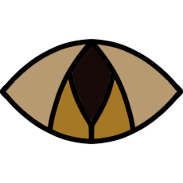
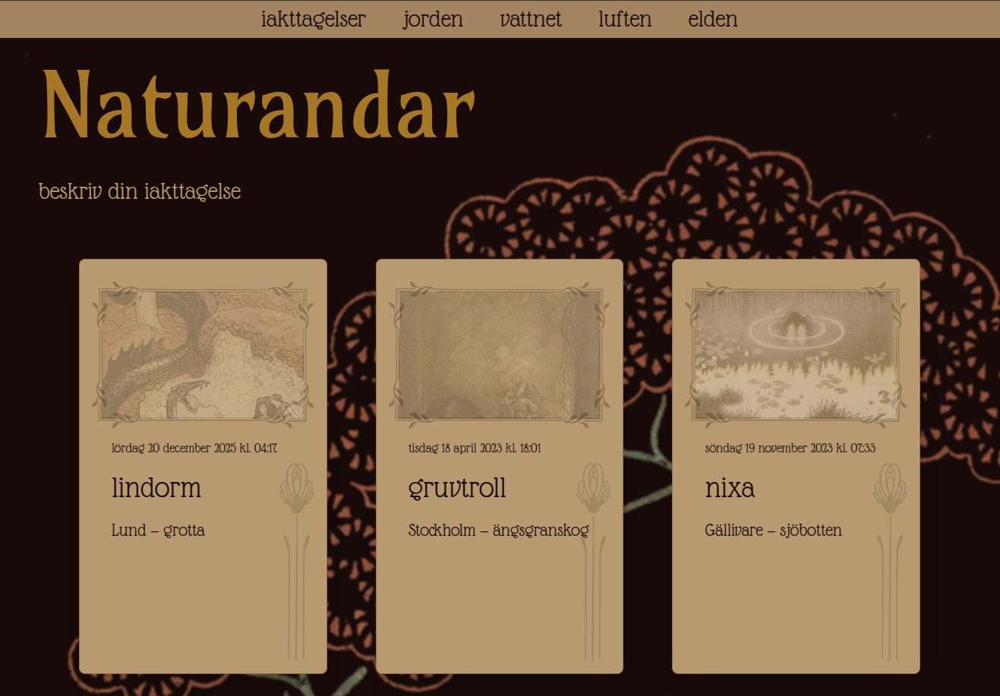
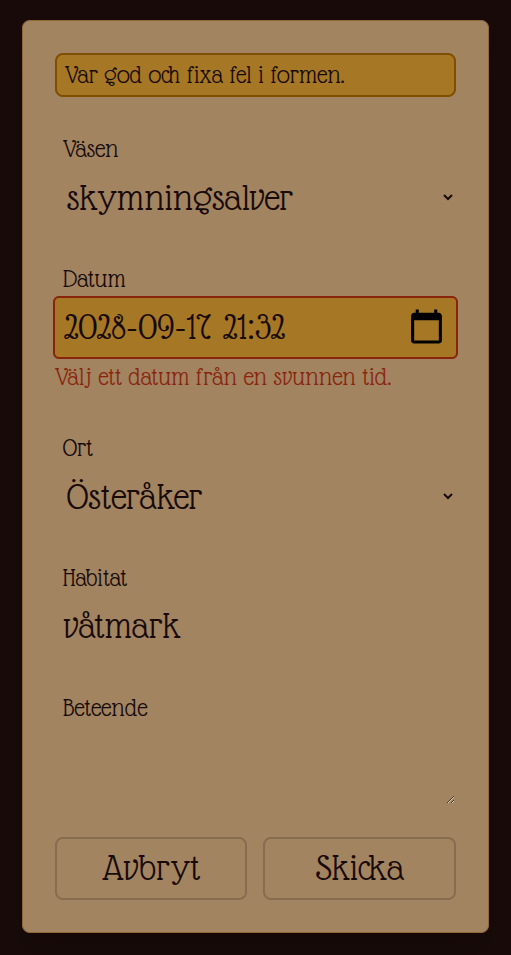

# Naturandar 
A website collecting observations of mythic creatures and other entities of the natural environment.

## :star: Features
- Browse observations
- Filter observations by element
- Record your own observation
- Focus on accessible design

## :camera: Screenshots

Landing page showing recorded observations.

---


An incorrectly filled form showing a validation error message.

---

## :wheel: Under the hood
- Combined client- and server-side form validation
- Focus management with React hooks
- REST API with mock JSON server
- API mutation with server actions

## :arrow_down_small: Installation
```bash
git clone git@github.com:josiefinis/naturandar.git
cd naturandar/frontend
npm install
npm run dev:full
```
Open http://localhost:3000 with your browser to see the result.

## :sewing_needle: Technologies
- Next.js
- React
- Typescript
- Tailwind
- Zod

## :open_file_folder: Project structure
```
.
├── README.md
└── frontend
    ├── app
    │   ├── iakttagelser
    │   │   ├── actions.ts                     # Server actions 
    │   │   └── beskriv
    │   │       └── page.tsx                   # Create observation page
    │   ├── layout.tsx                         # Root layout
    │   ├── om
    │   │   └── page.tsx                       # About page
    │   ├── page.tsx                           # Root page
    │   └── referenser
    │       └── page.tsx                       # References page
    │
    ├── components
    │   ├── forms
    │   │   ├── add-observation-form.tsx       # Create observation form
    │   │   ├── polite-message.tsx             # Validation message with aria-live
    │   │   └── submit-button.tsx              # client submit button with useFormStatus
    │   ├── navigation
    │   │   ├── footer.tsx
    │   │   ├── main-nav.tsx                   # Banner navigation bar
    │   │   ├── pagination.tsx                 # Pagination controls 
    │   │   └── skip-link.tsx                  # Skip link
    │   ├── main-content.tsx                   # <main> element that takes focus on route change
    │   └── observation-card.tsx               # Card for displaying observations
    │
    ├── lib
    │   ├── api.ts                             # Api fetch functions
    │   ├── errors.ts                          # Error handling functions
    │   ├── schemas.ts                         # Zod validation schemas
    │   ├── types.ts                           # TypeScript type definitions
    │   └── utils.ts                           # Utility functions
    └── server
        ├── middleware.js                      # Custom json-server middleware
        └── observations.json                  # Mock json-server database
 ```
## :mortar_board: Lexicon
This project was part of the frontend education with Lexicon. Previous and subsequent projects can be found below.

- [Recept (HTML & CSS)](https://github.com/josiefinis/recept)
- [Evently (HTML & CSS)](https://github.com/josiefinis/Evently-2026)
- [Task tracker (Typescript)](https://github.com/josiefinis/task-tracker)
- [Async Practice (Typescript)](https://github.com/josiefinis/async-practice)
- [Josifinix (Next.js, React, TypeScript & Tailwind)](https://github.com/josiefinis/intro-nextjs)
- [Webshop (Agile, GitHub Projects, Next.js, React & Tailwind)](https://github.com/Martin-Joensson/projekt-agila-metoder-webshop)
- **Naturandar (Next.js, React, TypeScript & Tailwind)**

## :bust_in_silhouette: Author
Josefin Wall ([@josiefinis](https://github.com/josiefinis))
